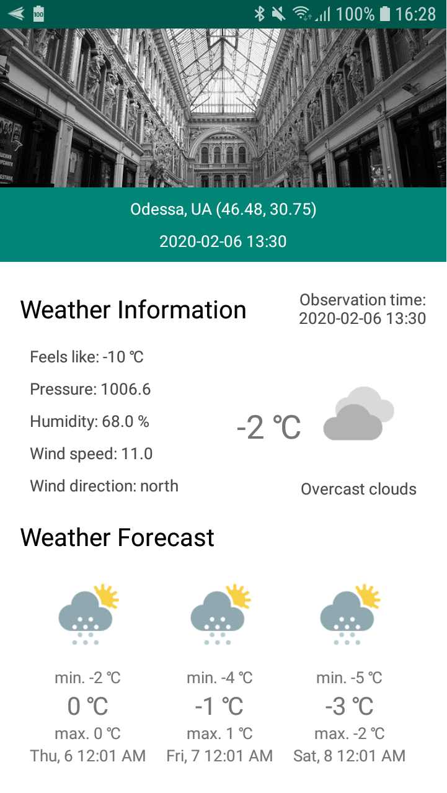

# WeatherDemoApplication
Test application for study new skills

This project use weatherbit and pixabay API for fetching data

This project use below libraries:

    'androidx.core:core-ktx:1.1.0'
    'androidx.fragment:fragment-ktx:1.2.0'
    'androidx.constraintlayout:constraintlayout:1.1.3'
    "androidx.lifecycle:lifecycle-extensions:$lifecycle"
    "androidx.lifecycle:lifecycle-livedata-ktx:$lifecycle"
    "androidx.lifecycle:lifecycle-viewmodel-ktx:$lifecycle"
    "androidx.room:room-runtime:$room_version"
    'io.reactivex.rxjava2:rxjava:2.2.9'
    'io.reactivex.rxjava2:rxandroid:2.0.2'
    "com.github.bumptech.glide:glide:$glide_version"
    "com.google.dagger:dagger:$dagger_version"
    "com.google.dagger:dagger-android:$dagger_version"
    "com.google.dagger:dagger-android-support:$dagger_version"
    "com.squareup.retrofit2:retrofit:$retrofit_version"
    "com.squareup.retrofit2:converter-gson:$retrofit_version"
    'com.jakewharton.retrofit:retrofit2-kotlin-coroutines-adapter:0.9.2'
    'com.squareup.okhttp3:logging-interceptor:4.3.1'
    'com.google.code.gson:gson:2.8.6'
    'com.google.android.gms:play-services-location:17.0.0'
    'io.supercharge:shimmerlayout:2.1.0'
    'com.jakewharton.timber:timber:4.7.1'

For proper work of application it must contains base_config.gradle file with next content:

ext {
    buildConfigDebug = [
            server_url: "https://api.weatherbit.io/v2.0/",
            api_key : 'YOUR_KEY',
            image_api_key : 'YOUR_KEY',
            image_base_url : 'https://pixabay.com/api/'
    ]
}
